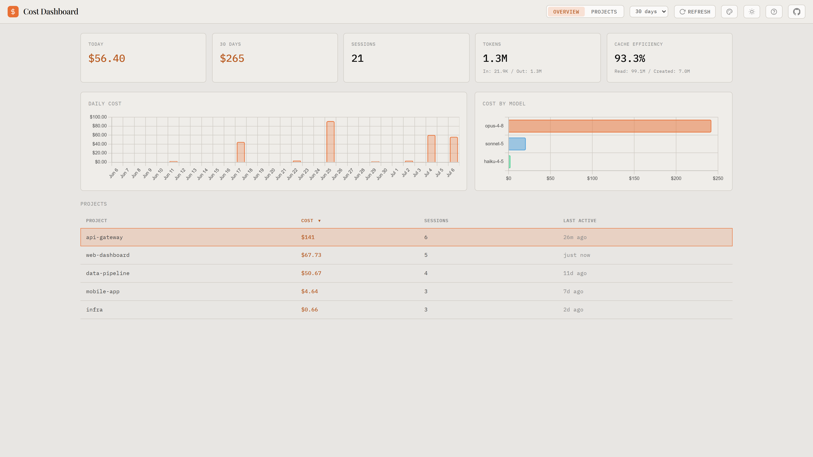
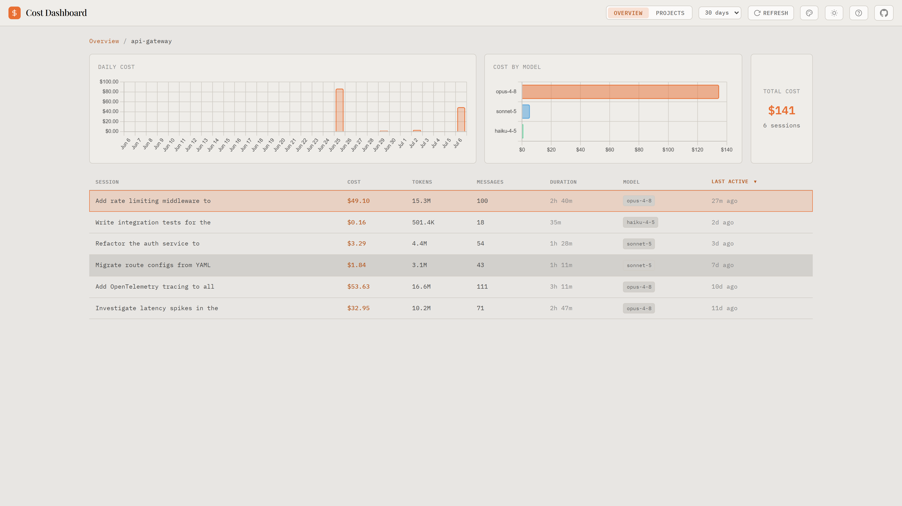
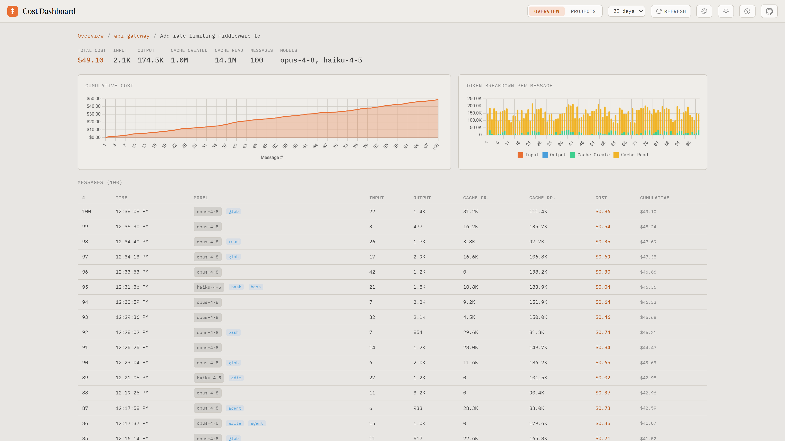
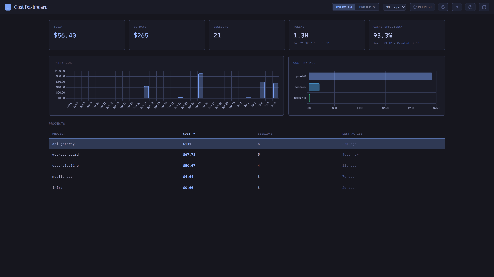

# Claude Code Cost

[](https://www.npmjs.com/package/claude-code-cost)
[](LICENSE)
[](https://www.npmjs.com/package/claude-code-cost)

**[Live Demo & Docs](https://nikiforovall.blog/claude-code-cost/)**

> Know what [Claude Code](https://docs.anthropic.com/en/docs/claude-code) costs you — per day, per project, per session.



## Getting Started

```bash
npx claude-code-cost --open
```

That's it — no hooks, no config. The dashboard reads the JSONL session logs Claude Code already writes to `~/.claude/projects/` and aggregates them server-side. Completely read-only; nothing leaves your machine.

## Features

- **Top-down drill-down** — total → project → session → message; every number is one click from its breakdown
- **Dynamic pricing** — live model prices from [LiteLLM](https://github.com/BerriAI/litellm) with tiered pricing (200K threshold), cache token costs, and fast mode multipliers; offline fallback included
- **Daily cost chart** — configurable range from 1 day to 1 year
- **Cost by model** — see how spend splits across Opus, Sonnet, and Haiku
- **Cache efficiency** — cache reads vs. fresh input tokens across sessions
- **Session detail** — cumulative cost curve, stacked token bars, per-message table with model, tools, and running total
- **Accurate accounting** — same pricing logic as [ccusage](https://github.com/ryoppippi/ccusage): pre-calculated `costUSD` when present, deduplication by `messageId + requestId`
- **17 color themes** — Ember, Gruvbox, Catppuccin, Tokyo Night, Dracula, Nord, and more — each in light and dark, PWA installable
- **Hub integration** — runs standalone or as a tab in [Claude Code Hub](https://github.com/NikiforovAll/claude-code-hub) alongside Kanban, Marketplace, and Memory







## Configuration

```
--port <number>   Custom port (default: 3543, falls back if busy)
--dir <path>      Custom Claude config dir (default: ~/.claude)
--open            Open browser on start
```

The config dir can also be set via the `CLAUDE_CONFIG_DIR` environment variable.

## License

MIT
